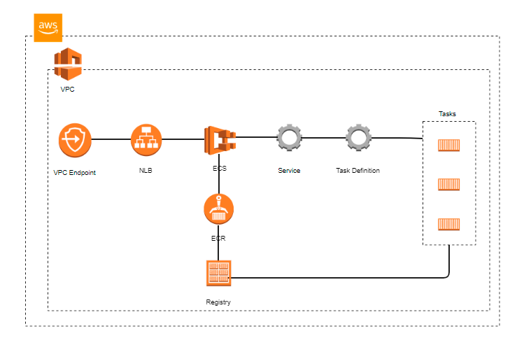

# Aplicação de Recomendação de Noticias 
A Aplicação disponibiliza um api com um modelo de Machine Learning já treinado, que efetuar recomendações de Noticias para os usuários do Portal `globo.com`.

## Pre-requisitos

A conta Aws que vai ser instalado aplicação deve conter os seguintes requisitos:
- VPC COM internet gateway
- Subnet Configuradas
- Route table configurada com pelo menos com 1 rota publica;
Exemplos: 
"DestinationCidrBlock": "172.31.0.0/16" → Isso significa que todo o tráfego dentro da VPC está sendo roteado internamente.
"DestinationCidrBlock": "0.0.0.0/0" → Todo o tráfego para a Internet está indo para o Internet Gateway 

📌 O Router table deve estar conectada a um Internet Gateway (IGW), pois o tráfego para 0.0.0.0/0 (Internet) da subnet publica está roteado para o IGW.

- Deployment do Modelo já esta no S3
- Arquivos S3 base historica

### Arquitetura ECS em Fargate

<p align="center">
  <br>
</p>


# Description
This terraform script creates on AWS the components required for Data Processing stage in Infra solution. The architecture is composed by 1 S3 bucket refine, 1 S3 Bucket Rejected


## 🚀 Build Aplicação - Build e Push da Aplicação para o Amazon ECR

Este workflow define um **pipeline de CI/CD** utilizando **GitHub Actions** para **compilar**, **empacotar** e **enviar a imagem Docker** da aplicação para o **Amazon Elastic Container Registry (ECR)**.

## 📌 Fluxo do Pipeline

O pipeline é acionado **automaticamente** quando um **Pull Request** é fechado e mesclado na branch `main`.

## 🔍 Etapas do Processo

### 🔹 1. Configuração do Ambiente

- O pipeline é executado em um runner do GitHub (Ubuntu).
Apenas Pull Requests mesclados na branch main disparam a execução.

### 🔹 2. Checkout do Código
- Faz o clone do repositório no runner do GitHub.


### 🔹 3. Verificação da Versão do Docker
- Confirma que o Docker está instalado e disponível.

### 🔹 4. Leitura das Configurações da Aplicação

- Extrai informações do arquivo application.yaml, como:
  Nome do pipeline
  ID da conta AWS
  Região da AWS
- Armazena essas informações como variáveis de ambiente ($GITHUB_ENV).


### 🔹 5. Configuração das Credenciais AWS

- Configura as credenciais da AWS para permitir a interação com o ECR.


### 🔹 6. Verifica se a Aplicação Deve ser Destruída
- Lê um arquivo config_destroy.yaml para verificar se o deploy deve ser destruído (true ou false).

### 🔹 7. Login no Amazon ECR

- Autentica no ECR para permitir a criação e envio da imagem Docker.

### 🔹 8. Criação do Repositório no ECR (se necessário)
- Verifica se o repositório já existe no ECR.
Se não existir, cria um novo repositório ECR.

### 🔹 9. Destruição do Repositório ECR (se necessário)
- Se a flag destroy estiver ativada, o repositório será excluído.

### 🔹 10. Construção da Imagem Docker
- Navega até o diretório app e constrói a imagem Docker com a tag latest.

### 🔹 11. Push da Imagem para o Amazon ECR
- Envia a imagem Docker para o Amazon ECR.

### 🔹 12. Salvar a URI da Imagem no Ambiente
- Salva o endereço da imagem Docker (IMAGE_URI) em um arquivo image_uri.env.

### 🔹 13. Upload da URI da Imagem como Artifact

- Faz upload do arquivo image_uri.env como um artifact no GitHub Actions.
Isso permite que outros jobs (como DeployInfra) recuperem essa informação.

## Run Script Infraestrutura

### Terraform init
Para executar o comando terraform init, é necessário passar a opção -backend-config com as variáveis do estado remoto do Terraform. Essas variáveis podem ser encontradas em inventories/{environment_label}/backend.tfvars.

Exemplo:
```bash
terraform init -backend-config=inventories/dev/backend.tfvars # init terraform for dev environment
```

### Terraform plan
Para executar o comando `terraform plan`, é necessário passar a opção `-var-file` com as variáveis do ambiente do Terraform. Essas variáveis podem ser encontradas em `tfvars/{environment_label}/variables.tfvars`.
Exemplo:
```bash
terraform plan -var-file=inventories/dev/variables.tfvars # run plan for dev environment
```
**Observação:** Variáveis sensíveis são omitidas dos arquivos de variáveis e devem ser configuradas de outra forma. Mais informações sobre como proteger variáveis sensíveis podem ser encontradas em [https://learn.hashicorp.com/tutorials/terraform/sensitive-variables](https://learn.hashicorp.com/tutorials/terraform/sensitive-variables).s

### Terraform apply
Similar ao `terraform plan`, a opção `-var-file` também deve ser passada para o comando `terraform apply`.
Exemplo:
```bash
terraform apply -var-file=inventories/dev/variables.tfvars # run apply for dev environment
```

### Terraform destroy(destroy objects)
Similar ao comando terraform plan, a opção -var-file também deve ser passada para o comando terraform apply.
Exemplo:
```bash
terraform destroy -var-file=inventories/dev/variables.tfvars # run apply for dev environment
```


## 🚀 Monitoramento
###  O que esse Dashboard Mostra

| Gráfico 📊          | Métrica                                      |
|---------------------|---------------------------------------------|
| **Uso de CPU**      | Percentual de uso da CPU do ECS            |
| **Uso de Memória**  | Percentual de memória usada pelo ECS       |
| **Total de Requisições** | Contagem de requisições recebidas pelo ALB |
| **Erros 5XX**       | Total de erros 5XX no ALB                  |
| **Latência (p95)**  | Tempo de resposta para 95% das requisições |
| **Latência Média**  | Tempo médio de resposta da API             |
